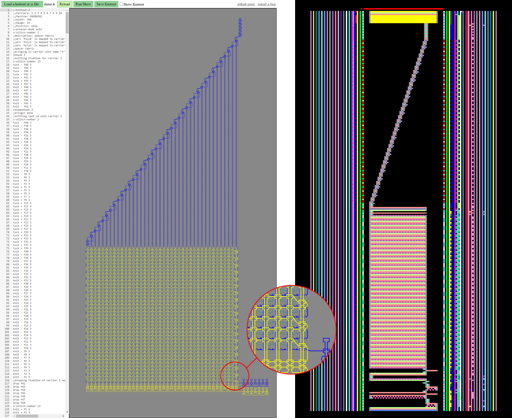

# Knitting Utils

[NodeJS](https://nodejs.org/en/) based utilities for generating knitout files using [CMU knitout library](https://textiles-lab.github.io/posts/2017/11/27/kout1/). Files are in particular targeted for Shima Seiki SWG N2 backend.

## dependencies

- [knitout-frontend-js](https://www.npmjs.com/package/knitout) npm package
- for using the preconfigured "convert to DAT" Visual Studio Code task, you need to create an environment variable ```KNITOUT_BACKEND_SWG``` pointing to the path containing your ```knitout-to-dat.js``` converter script file.
- the script [dat2png.js](./dat2png.js) requires the node-canvas [npm package](https://www.npmjs.com/package/canvas) (tested with 2.8.0).
- [min-document](https://www.npmjs.com/package/min-document) npm package is required by the sample scripts for command line argument parsing.

## Usage

Clone the repository and, in the repository root folder, run ```npm link``` to create a symlink in the global npm package folder. In order to use the package in some other location, call ```npm link knittingutils``` in the respective directory. See [npm-link documentation](https://docs.npmjs.com/cli/v7/commands/npm-link) for more details.

See the included [samples scripts](./samples/) for basic usage of the package. When used from a different location, import the main file ```knittingutils.js``` and use, e.g. ```KnitSequence``` constructor like this:

```
let ku = require("knittingutils");
```

### knitOutWrapper.js

The script [knitoutWrapper.js](./lib/knioutWrapper.js) is basically exactly this, a wrapper around the knitout library, providing some convenience functions such as ```bringIn```, ```castOn```, and ```castOff```, automatic handling of half gauging, and always keeping track of current machine status (racking status, current speed and stitch numbers, what needles are currently in use, what loops of what carrier(s) and in what order do needles currently hold, etc.), and performing extended error checking.

### knitSequence.js

[knitSequence.js](./lib/knitSequence.js) is a convenience script making use of ```knitOutWrapper.js```. The idea is to construct a knitting program by providing knit commands on a base of either courses for each yarn, without having to worry much about current carrier positions and directions. Cast-on and cast-off is automatically taken care of, as well as off-knit yarn fixations when a yarn is first used. 

First, a ```KnitSequence``` object must be created and used yarns need to be specified, e.g.

```
let ks = new ku.KnitSequence();

//create yarn descriptor
let yarnCotton = ks.makeYarn("Cotton");
```

Beginnings of new courses have to explicitly specified by calling ```ks.newCourse```. Subsequently, knitting instructions can be inserted (left-to-right) to specify a course:

```
ks.newCourse(yarnCotton);           //create new cotton course
ks.insert(yarnCotton, "k", 20);     //inserts 'front knit' for 20 needles
    //resulting course: "kkkkkkkkkkkkkkkkkkkk"
    //                   ^                  ^
    //                   needle #1          needle #20
```

Finally, yarns have to be mapped to machine carriers and the knitout file has to be generated:

```
//map yarn to carrier #3
ks.mapYarn(yarnCotton, 3);

//create knitout and write file
ks.generate(outFileName, "single jersey fabric");
```

Supported commands are the following:

| specifier | needle operation       |
| --------- | -----------------------|
|  ```.```  | no operation           |
|  ```k```  | knit front             |
|  ```K```  | knit back              |
|  ```b```  | knit front+back        |
|  ```t```  | tuck front             |
|  ```T```  | tuck back              |
|  ```B```  | tuck front + back      |
|  ```x```  | tuck front + back      |
|  ```X```  | knit back + tuck front |
|  ```-```  | explicit miss front    |
|  ```_```  | explicit miss back     |
|  ```y```  | split front to back    |
|  ```Y```  | split back to front    |

The instruction-strings can hold a sequence of knitting instructions, which can be repeated, e.g.

```
ks.newCourse(yarnCotton);           //create new cotton course
ks.insert(yarnCotton, "kkkt", 20);  //inserts sequence of 3 front knits, followed by 1 tuck, repeated for 20 needles
    //resulting course: "kkktkkktkkktkkktkkkt"
    //                   ^                  ^
    //                   needle #1          needle #20
```

The reason a course has to be specified explicitly is you are able to construct your courses by concatenating sequences like the following:

```
ks.newCourse(yarnCotton);           //create new cotton course
ks.insert(yarnCotton, "kK", 14);    //inserts 1x1 rib sequence for 14 needles (left hand wales)
ks.insert(yarnCotton, "tT");        //inserts front and back tuck
ks.insert(yarnCotton, "kK", 14);    //inserts 1x1 rib sequence for 14 needles (right hand courses)
    //resulting course: "kKkKkKkKkKkKkKtTkKkKkKkKkKkKkK"
    //                   ^             ^              ^
    //                   needle #1     needle #15     needle #30
```

Note in the second call of ```insert``` in the example above, you can just skip the ```needleCount``` argument, in which case the instruction-string is just inserted as-is. One more handy argument is ```repeatOffset```, which specifies what index of the pattern should be used for the left hand needle. This can be used to shift the pattern depending on, e.g., a counter:

```
for(let i = 0; i < 4; i++) {
    ks.newCourse(yarnCotton);               //create new cotton course
    ks.insert(yarnCotton, "kkk-", 20, i);   //insert sequence of three front knits and one miss for 20 needles
}
    //resulting courses: "kkk-kkk-kkk-kkk-kkk-"
    //                   "kk-kkk-kkk-kkk-kkk-k"
    //                   "k-kkk-kkk-kkk-kkk-kk"
    //                   "-kkk-kkk-kkk-kkk-kkk"
    //                    ^                  ^
    //                    needle #1          needle #20
```

By creating multiple yarns, more complex structures can be created with a few lines of code. For instance, the following script generates a basic spacer fabric:

```
let ku = require("knittingutils");
let ks = new ku.KnitSequence();

let yarnPoly0 =    ks.makeYarn("Poly0");
let yarnPoly1 =    ks.makeYarn("Poly1");
let yarnNylon =    ks.makeYarn("Nylon");

ks.comment("spacer fabric");
for(let j = 0; j < 40; j++) {

    if(j) { //skip filler for first course
        ks.newCourse(yarnNylon);
        ks.insert(yarnNylon, "tT", 40);
    }

    ks.newCourse(yarnPoly0);
    ks.insert(yarnPoly0, "k", 40);

    ks.newCourse(yarnPoly1);
    ks.insert(yarnPoly1, "K", 40);
}

ks.mapYarn(yarnPoly0, 3);
ks.mapYarn(yarnPoly1, 4);
ks.mapYarn(yarnNylon, 8, false);  //skip fixation field for nylon filler

ks.generate(outFileName, "spacer fabric");
```

The result is the following knitting program, including cast-on, setting of stitch and speed numbers, inserting in-hooks and knitting fixation fields at first use of yarns (optional), inserting out-hooks at last use of yarns, cast-off performed with the last yarn in use:



More documentation will follow; in the meantime, please refer to the provided samples for further usage.

## Building Samples

The code is being developed in [Visual Studio Code](https://code.visualstudio.com/), therefore the repository provides task configurations in [tasks.json](./.vscode/tasks.json), for running the sample scripts via NodeJS:
- run script: runs NodeJS on the JS currently open in the editor, generating a knitout file of the script's file name.
- convert to DAT: runs NodeJS on the knitout SWG backend. Make sure you set an environment variable ```KNITOUT_BACKEND_SWG``` containing the path to a copy of the ```knitout-to-dat.js``` converter script. The filename for input ```.k``` and output ```.dat``` is taken from the file currently opened in the editor.
- DAT to PNG: creates a ```PNG``` image file from the previously generated ```.dat``` file, generating a schematic of the knitting program, as displayed in Shima Seiki KnitPaint, for quick visual verification. The filename is again set from the file currently opened in the editor.
- generate all: runs all the above.
- run all sample scripts: runs the shell script [buildAll.cmd](./samples/buildAll.cmd), which re-builds knitout files for all provided [sample scripts](./samples/).


## Links

Further information about knitout format and extensions can be found here:
- knitout [specification](https://textiles-lab.github.io/knitout/knitout.html)
- knitout [Shima Seiki SWG N2 extensions](https://textiles-lab.github.io/knitout/extensions.html) (incomplete)

A (slightly modified) copy of the CMU Textiles Lab's [knitout live visualizer](https://textiles-lab.github.io/knitout-live-visualizer/) is also hosted on the Media Interaction Lab webspace [here](https://mi-lab.org/files/utils/knitout-live-visualizer/visualizer.html), with added drag'n'drop functionality for knitout files from file explorer, and yarn coloring analog to the color scheme used in Shima Seiki KnitPaint, making it easier to read for folks with a heavy KnitPaint-background.

## Notes

When used with knitout npm package 1.0.2 and below, for the speed-number feature to work, the code requires a slight modification of the file ```knitout.js```: the safety check in line 348 (function ```speedNumber```), i.e. the check for ```value > 0``` needs to be changed to ```value >= 0```, to allow the default value ```0```.

## Todo

- extend README.md to include a few basic examples of usage in form of script snippets
- provide API documentation
- ```knitoutWrapper.js```: extensive error checking (validity of arguments and current machine/carrier/hook states, etc.)
- ```knitSequence.js```: sliders still not implemented
- ```knitSequence.js```: maybe think of a more intelligent way of deciding which way a carrier will have to travel
- ```knitSequence.js```: find way to specify 2nd stitch (make extension for knitout and converter?)
- ```knitSequence.js```: cast-on is skipped if first course is (usually by accident?) empty -- find a way to make this up later
